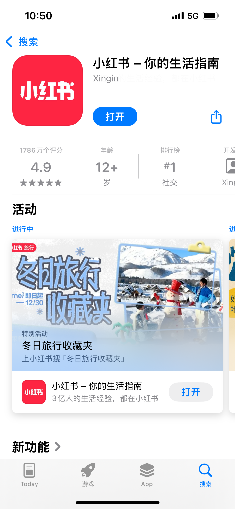
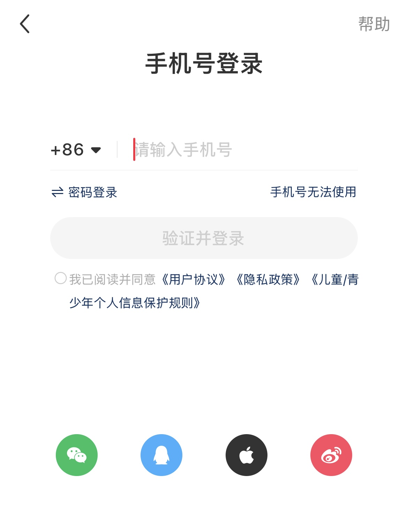
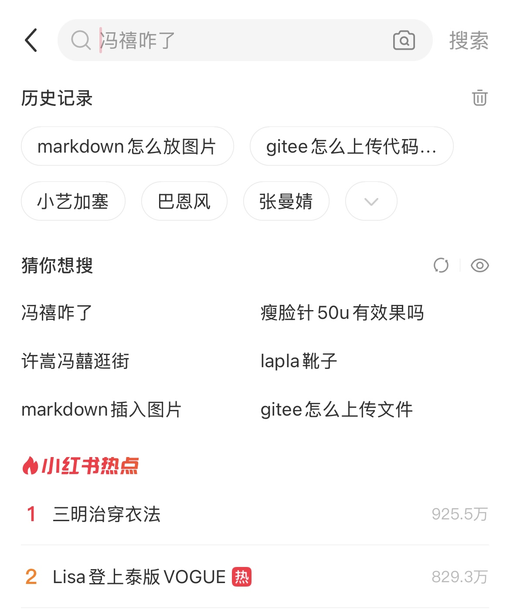
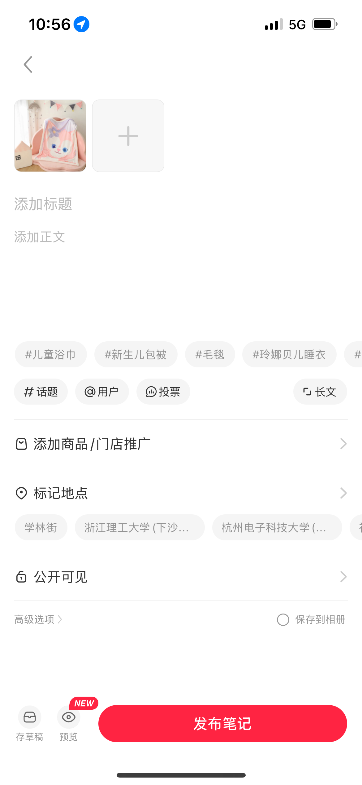
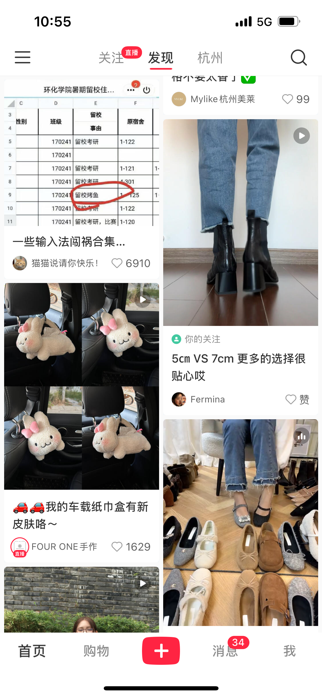
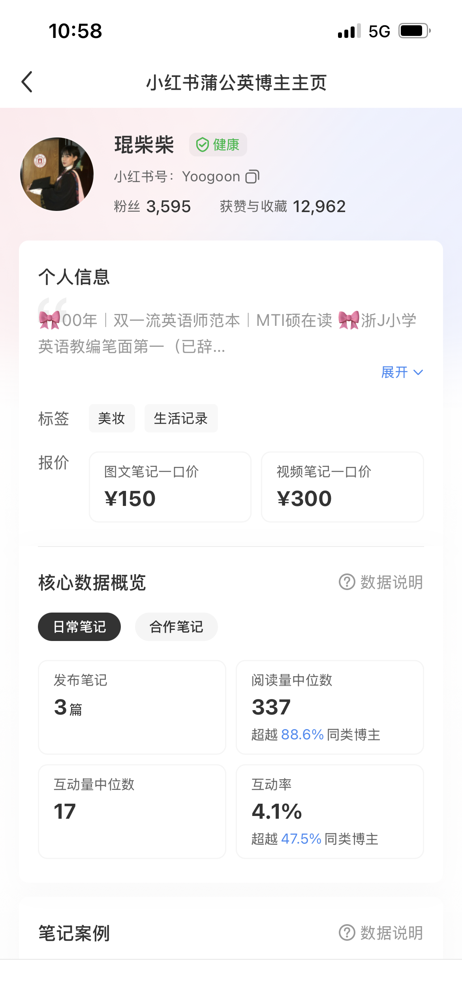

### Software: Xiaohongshu (Little Red Book)

Xiaohongshu, also known as Little Red Book, is a popular social media and e-commerce platform in China. Below is a detailed breakdown of the tasks users need to perform, sequenced in a logical order, along with supporting concepts and information.

#### Tasks that the User Needs to Perform:

1. **Download and Install the App**
   - **Description**: Users need to download the Xiaohongshu app from the App Store (for iOS users) or from various Android app stores.
   - **Supporting Concepts**: 
     - Ensure that the device has sufficient storage space and meets the app's system requirements.
     
   
2. **Sign Up and Create a Profile**
   - **Description**: Upon opening the app, users must sign up for an account using their email, phone number, or a third-party social media account.
   - **Steps**:
     1. Click on the "Sign Up" button on the login screen.
     2. Choose a sign-up method (email, phone number, or third-party account).
     3. Follow the prompts to complete the sign-up process, including verifying the account.
     4. Set up a profile by adding a profile picture, username, bio, and other relevant information.
   - **Supporting Concepts**: 
     - Profiles with complete and authentic information are more likely to gain trust and followers.
     - Users can choose to make their profiles public or private.
   
3. **Familiarize with the App's Interface and Features**
   - **Description**: Users should take some time to explore the app's interface, understand its features, and navigate through different sections such as the Home feed, Explore page, and user profiles.
   - **Steps**:
     1. Browse through the Home feed to see recommended content.
     2. Visit the Explore page to discover new topics and trends.
     3. Check out user profiles to see how others present themselves and their content.
   - **Supporting Concepts**: 
     - Understanding the app's features will help users make the most of their Xiaohongshu experience.
     - Users can customize their Home feed by following topics and users that interest them.
   
4. **Browse and Discover Content**
   - **Description**: Users can browse through various categories and topics to find content that interests them.
   - **Steps**:
     1. Use the search bar to look for specific topics or keywords.
     2. Browse through recommended content on the Home feed.
     3. Explore different categories such as beauty, fashion, food, travel, etc.
     4. Engage with content by liking, commenting, and sharing.
   - **Supporting Concepts**: 
     - Xiaohongshu's algorithm personalizes content recommendations based on user preferences and behavior.
     - Users can save posts they like by bookmarking them or adding them to albums.
   
5. **Create and Share Content**
   - **Description**: Users can create and share their own content in the form of notes, which can include text, images, and videos.
   - **Steps**:
     1. Click on the "+" button at the bottom of the screen to start creating a new note.
     2. Choose the type of content to share (photo, video, or text).
     3. Edit and enhance the content using the provided tools (e.g., filters, stickers, text overlays).
     4. Add a captivating title and description.
     5. Click on "Publish" to share the note with the Xiaohongshu community.
   - **Supporting Concepts**: 
     - High-quality and engaging content is more likely to attract attention and interaction.
     - Users can tag other users, locations, and brands in their posts to increase visibility.
   
6. **Engage with the Community**
   - **Description**: Users can interact with other users by liking, commenting on, and sharing their posts. They can also follow other users to stay updated on their latest content.
   - **Steps**:
     1. Like and comment on posts that resonate with you.
     2. Share interesting posts with your followers.
     3. Follow users and topics that interest you to stay updated.
     4. Respond to comments and messages from other users.
   - **Supporting Concepts**: 
     - Engaging with the community helps build connections and establish a presence on the platform.
     - Active users are more likely to gain followers and have their content seen by a wider audience.
   
7. **Shop for Products**
   - **Description**: Xiaohongshu features an integrated shopping platform where users can discover and purchase products directly within the app.
   - **Steps**:
     1. Browse through product recommendations and lists.
     2. Click on a product to view details and user reviews.
     3. Add the product to your cart or click on "Buy Now" to proceed with the purchase.
     4. Follow the checkout process, including selecting a shipping address and payment method.
   - **Supporting Concepts**: 
     - Xiaohongshu's shopping platform offers a seamless shopping experience with a wide range of products.
     - Users can benefit from user-generated content and reviews to make informed purchasing decisions.
   
8. **Participate in Brand Collaborations and Promotions (Optional)**
   - **Description**: Users, especially influencers, can collaborate with brands for product promotions, sponsored posts, and other marketing campaigns.
   - **Steps**:
     1. Reach out to brands or agencies that align with your content and audience.
     2. Discuss collaboration details, including compensation, content requirements, and timelines.
     3. Create and share sponsored content according to the agreed terms.
     4. Track the performance of the collaboration and adjust strategies as needed.
   - **Supporting Concepts**: 
     - Brand collaborations can provide users with opportunities to earn income and gain exposure.
     - It's important to maintain authenticity and transparency with your audience when participating in brand collaborations.
   
By following this detailed sequence of tasks, users can fully utilize the features and functionalities of Xiaohongshu, from discovering and sharing content to shopping and collaborating with brands.